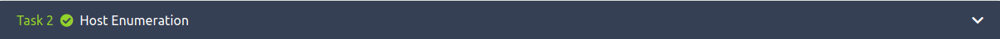
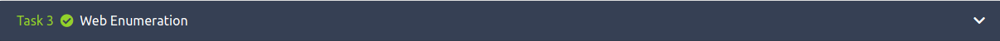
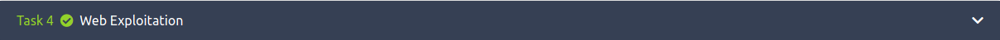

#The Code Caper

This is a writeup for the room [The Cod Caper at TryHackMe](https://tryhackme.com/room/thecodcaper)

I used Parrot OS to complet the room, so there might be a difference of syntax in the commands!

The target IP for me was 10.10.113.161 and that is what you will be seeing through my screenshots. Just replace by the target IP given to you when you deploy the machine.

Have fun!! 

CryptoTzipi aka CyberLola

VERY CUTE!! Read the story and deploy the machine!!
No answers needed for this one

We will start with our host enumeration by using nmap with the following command

'nmap -sC -A <IP> -T 4'

(the -T 4 switch is just to speed up things a little bit)

By doing that you will be able to answer all questions on task one!!

Next we will do web enumeration using the tool gobuster.
If you are unsure about the usage, just type
'gobuster -h' 

and go through the different options!
For our task here, we will use 

'gobuster dir -u http://IP -w /home/cryptotzipi/SecLists/Discovery/Web-Content/big.txt'

I usually go with the dirb lists such as common.txt but since the task tells us to use one of SecLists, I complied and used it!

We find something interesting in this scan!

That concludes task 3.

Typing our findings  into a browser...

And we got ourselves a login page!!
But we don't have any credentials :( ...
YET!

The task wants us to use a tool called sqlmap (it was VERY useful duing the eJPT exam!) 

WE will go ahead and use the command

'sqlmap -u http://IP/administrator.php --forms --dump'

And wait ... (hopefully you won't have to wait as long as I did!!) 

I have to apologize for the lack of screenshots showing the small table where the credentials can be seen and also the SQL injection vulnerabilities.. :(
(I forgot to take it and my machines now has long expired! N00b mistake, sorry about that)

'pingudad:secretpass'

And through the finished sqlmap scan we can find 3 SQL vulnerabilities!

 

